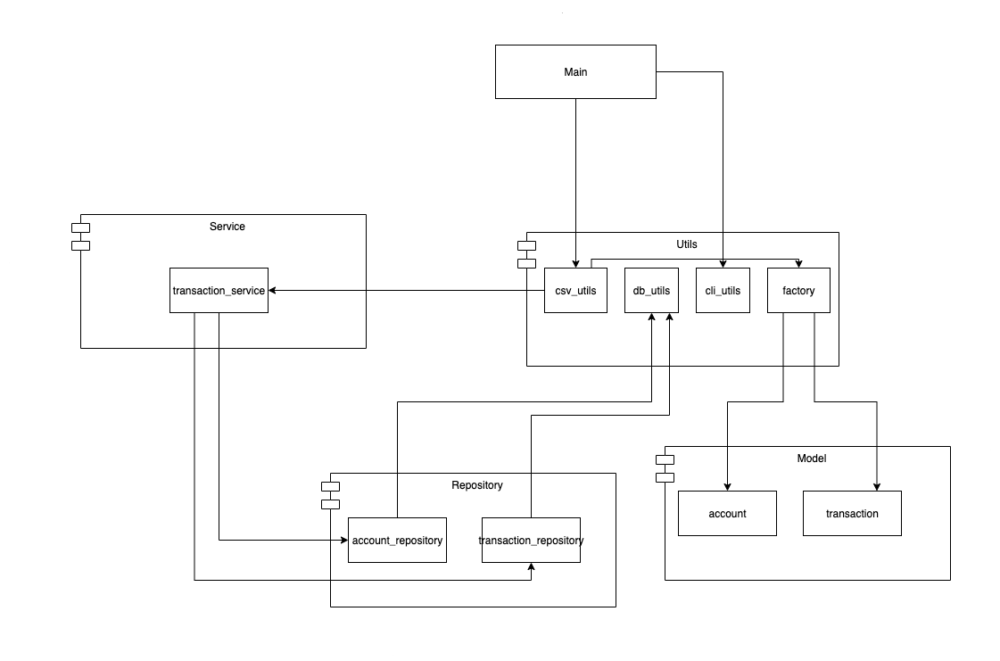
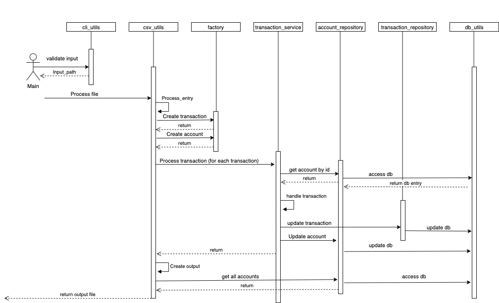
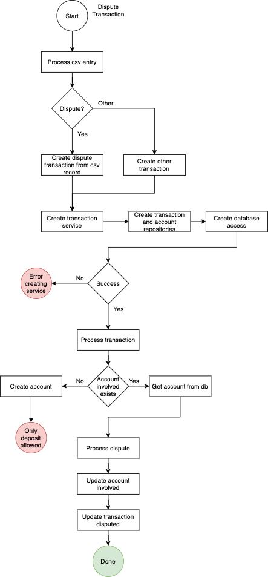
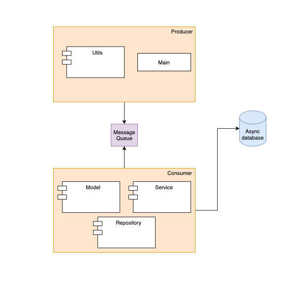

[![Contributors][contributors-shield]][contributors-url]
[![Issues][issues-shield]][issues-url]
[![LinkedIn][linkedin-shield]][linkedin-url]


<!-- PROJECT LOGO -->
<br />
<p align="center">
  <a href="https://github.com/vladhateganos/transaction_processing">
    
  </a>

<h3 align="center">Transaction Processing</h3>

  <p align="center">
    An awesome demonstration of Rust's power in a proof of concept application for transaction processing!
    <br />
  </p>

</br>

<!-- TABLE OF CONTENTS -->
<details open="open">
  <summary>Table of Contents</summary>
  <ol>
    <li>
      <a href="#about-the-project">About The Project</a>
      <ul>
        <li><a href="#built-with">Built With</a></li>
      </ul>
    </li>
    <li>
      <a href="#getting-started">Getting Started</a>
      <ul>
        <li><a href="#prerequisites-and-usage">Prerequisites and Usage</a></li>
      </ul>
    </li>
    <li>
      <a href="#design">Design</a>
      <ul>
        <li><a href="#components-diagram">Components diagram</a></li>
        <li><a href="#sequence-diagram">Sequence diagram</a></li>
        <li><a href="#flowchart-of-a-dispute-transaction">Flowchart of a dispute transaction</a></li>
        <li><a href="#design-decisions">Design decisions</a></li>
      </ul>
  </li>
    <li><a href="#notes-and-assumptions">Notes and assumptions</a></li>
    <li><a href="#contributing">Contributing</a></li>
    <li><a href="#license">License</a></li>
    <li><a href="#contact">Contact</a></li>
    <li><a href="#acknowledgements">Acknowledgements</a></li>
  </ol>
</details>


<!-- ABOUT THE PROJECT -->
## About The Project
The transaction processing is an application that reads possible transactions from a csv file and processes them before 
returning another csv file containing the results. It uses mongodb for storage, because the app has to keep track of its
clients and previous transactions. </br>
Processing a transaction means updating client accounts and ensure error safety along the way.

### Built With

* [Rust](https://www.rust-lang.org/)
* [Crates](https://crates.io/)
* [Mongodb](https://www.mongodb.com/)
* [Docker](https://www.docker.com/)

<!-- GETTING STARTED -->
## Getting Started


### Prerequisites and Usage
* Install git on your system
</br>

* Firstly, install Rust using their official instructions: https://www.rust-lang.org/tools/install
</br>
  
* Clone this repository by running the following command:
  ```sh
  git clone https://github.com/vladhateganos/transaction_processing.git
  ```
  
* Build and run the project by running:
  ```sh
  cargo run --release -- input.csv > output.csv
  ```
  * Note that input.csv is a file describing transactions. Modify it and play around with transactions and system's 
  behavior. </br>


* Run unit tests:
  ```sh
  cargo test
  ```
<!-- DESIGN -->
## Design
The design of this project can be described as a three layer architecure with the levels being the Controller, 
the Service and the Repository. The responsibilities go from top to bottom, controller just having to execute
an operation, it calls the service which holds the business logic. The service then calls the repository because it abstracts 
the database operations.
</br>
### Components diagram
<!-- COMPONENTS -->
<br />
<p align="center">
    

### Sequence diagram
<!-- SEQUENCE -->
<br />
<p align="center">
    

### Flowchart of a dispute transaction
<!-- SEQUENCE -->
<br />
<p align="center">
    
</p>

### Design decisions
Mongodb is used for storage because it scales easy and it is performant. For this proof of concept probably using
files whould have been enough but the layered architecture in combination with the mongo database are 
scalable, extensible and come out of the box with performance improvements described in "Future improvements".

<!-- Future improvements -->
## Future improvements
The diagram below explains how this project can be taken into the concurency realm, by using a thread pool to
handle messages from a message queue. Basically the project will be divided into an producer and a consumer 
, producer will put transactions in a message queue (async await could also be used here). The consumer will
benefit of a thread pool from which threads will treat transactions pulled from the message queue.
Mongodb could be used in async mode as opposed to how it is used now.
<!-- IMPROVEMENTS -->
<br />
<p align="center">
    

<!-- Notes and assumptions -->
## Notes and assumptions
* i32 ids were chosen for simplicity because serde does not support unsigned integer serialization.
* Collections(tables) from the database are dropped at the start of the program -> running it twice on the same
  dataset will produce the same output.
* Rustfmt was used on all files, no custom formatting was used.
* Any **invalid** csv entry will **STOP** the program at that point. This problem is fixed on 
 <TP23-fix-program-end-on-csv-error-input> branch but **not merged** on purpose.


<!-- CONTRIBUTING -->
## Contributing

1. Fork the Project
2. Create your Branch based on the issue id (`git checkout -b TP-<X>-AmazingFeature`)
3. Commit your Changes using issue id (`git commit -m 'TP-<X> - Added some AmazingFeature'`)
4. Push to the Branch (`git push --set-upstream ...`)
5. Open a Pull Request

<!-- LICENSE -->
## License

Distributed under the MIT License.


<!-- CONTACT -->
## Contact
[product-screenshot]: images/screenshot.png
Vlad Hategan - [@vladonis3](https://twitter.com/vladonis3) - vladhateganos@gmail.com


<!-- MARKDOWN LINKS & IMAGES -->
<!-- https://www.markdownguide.org/basic-syntax/#reference-style-links -->
[contributors-shield]: https://img.shields.io/github/contributors/vladhateganos/transaction_processing.svg?style=for-the-badge
[contributors-url]: https://github.com/vladhateganos/transaction_processing/graphs/contributors

[issues-shield]: https://img.shields.io/github/issues/vladhateganos/transaction_processing.svg?style=for-the-badge
[issues-url]: https://github.com//vladhateganos/transaction_processing/issues
[linkedin-shield]: https://img.shields.io/badge/-LinkedIn-black.svg?style=for-the-badge&logo=linkedin&colorB=555
[linkedin-url]: https://www.linkedin.com/in/vlad-hategan-1b5a8414b
